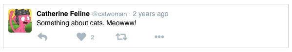

Pure React
-----

Running through all the examples in [Dave Ceddia's Pure React book](https://daveceddia.com/pure-react/) on learning React.

- Example 1: [Hello World!](./react-hello)
- Example 2: [JSX table](./jsx-exercises)
- Example 3: [Static Tweet](./static-tweet)
- Example 4: [Tweet component with props](./props-tweet)

- Example 5: [Tweet component using proptype validation](proptypes-tweet)
- Example 6: [Assorted components](./address-envelope) such as address, envelope and credit card
